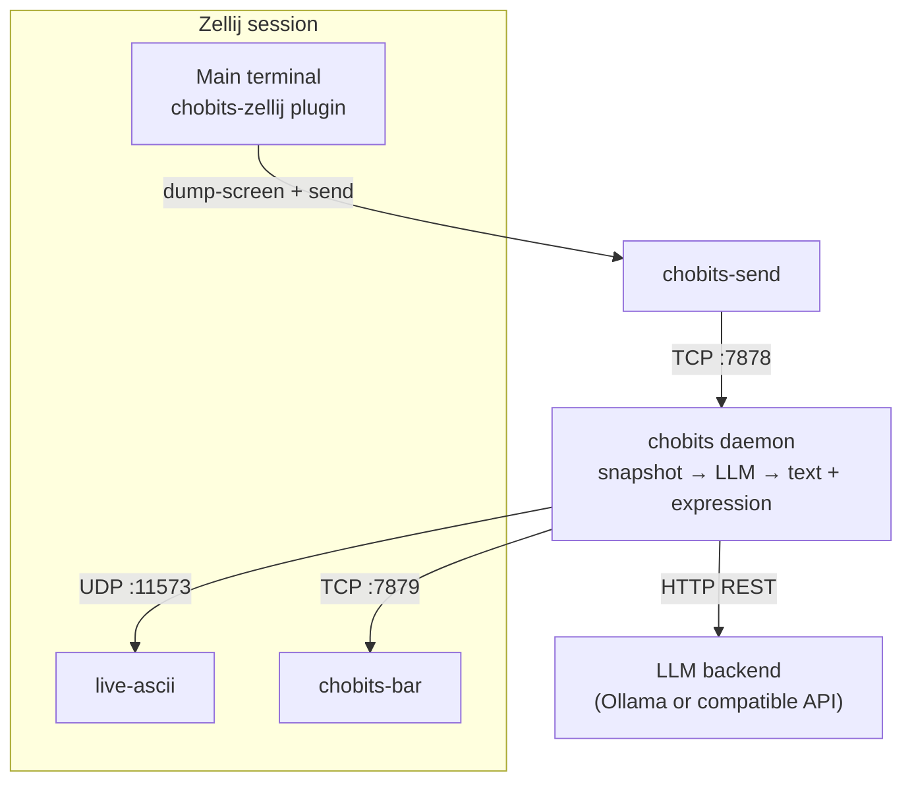

# Chobits

A cross-platform Live2D terminal companion living inside Zellij driven by LLM.


## Supported Platforms

- Linux
- Windows*

> \* **Building** on Windows requires MSYS2 UCRT64 or MINGW64. **Pre-built release archives** run on native Windows without MSYS2.

## Quick Start

Install the latest release with one command. The installer adds `chobits-start` to your user PATH and prints `[llm]` examples for `config.toml`.

### Install on Linux

Requires Bash or Zsh. Default install location: `~/.local/share/Chobits`.

```bash
. <(curl -LsSf https://raw.githubusercontent.com/NewComer00/Chobits/main/install.sh)
```

### Install on Windows

Requires PowerShell 5.1+. Default install location: `%LOCALAPPDATA%\Chobits`.

```powershell
irm https://raw.githubusercontent.com/NewComer00/Chobits/main/install.ps1 | iex
```

### Configure LLM Backend

Edit `config.toml` before your first run — by default at `~/.local/share/Chobits/config.toml` (Linux) or `%LOCALAPPDATA%\Chobits\config.toml` (Windows).

Find the `[llm]` section in the config. Chobits supports the following LLM backends

**Ollama**

```toml
[llm]
backend    = "ollama"
url        = "http://localhost:11434"
model      = "qwen3:0.6b"
max_tokens = 512
```

**OpenAI-compatible** (specify anything other than `ollama` at `backend` field)

```toml
[llm]
backend    = "deepseek"
url        = "https://api.deepseek.com"
model      = "deepseek-v4-flash"
max_tokens = 512
api_key    = "sk-..."
```

🎉 You're all set! Just run `chobits-start` to launch Chobits. 🚀

> [!TIP]
> `chobits-start` creates or re-attaches to a dedicated Zellij session — the daemon, live-ascii, bar, and plugin all run inside it, separate from your normal terminal sessions.
>
> - **First launch** — a new session is created automatically.
> - **Later runs** — `chobits-start` re-attaches to the existing session (you pick one if several are open).
> - **Detach** without stopping — press `Ctrl+o` then `d` in Zellij; run `chobits-start` again to come back.
> - **Quit entirely** — press `Ctrl+q` or close all panes.
>
> See [Run](#run) for subcommands and session management.

For manual installs, see [Download from Release](#download-from-release) or [Build from Source](#build-from-source). For all settings, see [Configuration](#configuration).

<details>
<summary>Click to expand more installer options</summary>

### Installer options

| Variable | Default | Description |
| -------- | ------- | ----------- |
| `CHOBITS_INSTALL_DIR` | `~/.local/share/Chobits` / `%LOCALAPPDATA%\Chobits` | Install location |
| `CHOBITS_VERSION` | `latest` | Release tag (e.g. `v0.2.0`) |
| `CHOBITS_LIBC` | `musl` | Linux only: `musl` or `gnu` |
| `CHOBITS_NO_MODIFY_PATH` | (unset) | Set to `1` to skip adding `bin/` to user PATH |

</details>

## Download from Release

<details>
<summary>Click to expand</summary>

> [!NOTE]
> The release package includes a free model ["Hiyori"](https://www.live2d.com/en/learn/sample/momose-hiyori/) downloaded from [Cubism](https://www.live2d.com/en/learn/sample/).
> 
> Before using this model, please review the ["Free Material License Agreement"](https://www.live2d.com/eula/live2d-free-material-license-agreement_en.html) and the ["Live2D Cubism Sample Data Terms of Use"](https://www.live2d.com/learn/sample/model-terms/).

Pre-built binaries are available on the [Releases](https://github.com/NewComer00/Chobits/releases) page for the following platforms:

|                  Package                   |    Platform    |                      Notes                      |
| ------------------------------------------ | -------------- | ----------------------------------------------- |
| `Chobits-x86_64-unknown-linux-gnu.tar.gz`  | x86_64 Linux   | Standard glibc-linked build                     |
| `Chobits-x86_64-unknown-linux-musl.tar.gz` | x86_64 Linux   | Lightweight, static-linked musl build           |
| `Chobits-x86_64-pc-windows-gnu.zip`        | x86_64 Windows | Runs on native Windows; no MSYS2 required   |

Download and extract the archive for your platform:

### Linux

To install Chobits on Linux, first download the latest static MUSL build and extract it:

```bash
wget https://github.com/NewComer00/Chobits/releases/latest/download/Chobits-x86_64-unknown-linux-musl.tar.gz
tar -xzf Chobits-x86_64-unknown-linux-musl.tar.gz
```

The static MUSL build (`Chobits-x86_64-unknown-linux-musl.tar.gz`) is recommended for broad compatibility across most Linux distributions. If you are on a glibc-based system, you may alternatively use `Chobits-x86_64-unknown-linux-gnu.tar.gz`.

### Windows

Download the latest Windows release:

```powershell
Invoke-WebRequest -Uri "https://github.com/NewComer00/Chobits/releases/latest/download/Chobits-x86_64-pc-windows-gnu.zip" -OutFile "Chobits-x86_64-pc-windows-gnu.zip"
Expand-Archive -Path "Chobits-x86_64-pc-windows-gnu.zip" -DestinationPath .
```

This will extract a `Chobits/` directory containing all necessary files. You can move the `Chobits` folder anywhere you prefer.

To proceed, continue with the [Deployment](#deployment) instructions.

</details>

## Build from Source

<details>
<summary>Click to expand</summary>

### Prerequisites

| Tool           | Description                                                                           |
|----------------|---------------------------------------------------------------------------------------|
| git            | Version control system to clone the repository.                                       |
| git-lfs        | Git extension for handling large files. Install it with: \`git lfs install\`.         |
| cargo          | Rust toolchain with native and 'wasm32-wasip1' targets.                               |
| cargo-binstall | For easier installation of Zellij. Install it with: \`cargo install cargo-binstall\`. |
| jq             | JSON processor.                                                                       |
| wget           | HTTP downloader.                                                                      |
| unzip          | ZIP extractor.                                                                        |
| make           | GNU Make (for live-ascii).                                                            |
| cc             | C toolchain (for live-ascii).                                                         |

For MSYS2 UCRT64/MINGW64 users, you can install these tools with:

``` bash
pacman -S ${MINGW_PACKAGE_PREFIX}-{git,git-lfs,rust,rust-wasm,jq,wget,gcc} unzip make
cargo install cargo-binstall  # This may take a while to compile
```

### Automated Build

```bash
git lfs install
git clone --depth 1 https://github.com/NewComer00/Chobits.git
cd Chobits
# git checkout v0.2.0   # optional: match a release tag
./build.sh --locked -y
```

### Manual Build

<details>
<summary>Click to expand manual build instructions</summary>

Create the local directory `install/Chobits/` to hold all binaries, configurations, Live2D models and expressions:

```bash
mkdir -p install/Chobits
```

#### Entrypoint Binaries

Install the entrypoint executable `chobits-start` to the directory `install/Chobits/bin/`:

```bash
cargo install --path "crates/chobits-start" --root install/Chobits
```

#### Local Binaries

Install other binaries to the directory `install/Chobits/local/bin/`:

```bash
for c in "" "-send" "-bar"; do cargo install --path "crates/chobits$c" --root install/Chobits/local; done
cargo install --path crates/chobits-zellij --root install/Chobits/local --target wasm32-wasip1
```

All three binaries (`chobits`, `chobits-send`, `chobits-bar`) and the WASM plugin (`chobits-zellij.wasm`) should now be in `install/Chobits/local/bin/`.

Then install dependencies (e.g. `live-ascii` and `zellij`) according to their instructions. For convenience, just install them into the same `install/Chobits/local/bin/` directory to keep everything self-contained.

Install `live-ascii` from source, GNU Make (`make`) and C toolchain (`cc`) required:

```bash
cargo install --git https://github.com/NewComer00/live-ascii --root install/Chobits/local
```

Install `zellij` from source or get the latest release binary with `cargo-binstall` tool:

```bash
# Get the version of zellij from Cargo.toml to ensure compatibility with the plugin
ZELLIJ_VER=$(cargo metadata --format-version 1 | jq -r '.packages[] | select(.name == "zellij-tile") | .version')

# Install zellij from source:
cargo install zellij --version ${ZELLIJ_VER} --root install/Chobits/local

# or get the latest release binary with `cargo-binstall` tool:
# cargo binstall zellij@${ZELLIJ_VER} --root install/Chobits/local

# For MSYS2 UCRT64/MINGW64 users, the simplest way is to download the pre-built binary from GitHub releases:
# wget https://github.com/zellij-org/zellij/releases/download/v${ZELLIJ_VER}/zellij-x86_64-pc-windows-msvc.zip
# unzip zellij-x86_64-pc-windows-msvc.zip -d install/Chobits/local/bin
```

Now you should have `live-ascii` and `zellij` binaries in `install/Chobits/local/bin/` as well.

#### Expressions

Place the pre-recorded expressions (OSF binary dumps) in `install/Chobits/expressions/`:

```bash
cp -r expressions install/Chobits/
```

#### Live2D Models

Download the Live2D model of your choice and place the `.model3.json` file somewhere accessible.  Note the path for the next step.

For example, you can download the free ["Hiyori"](https://www.live2d.com/en/learn/sample/momose-hiyori/) model from [Cubism](https://www.live2d.com/en/learn/sample/), and place the extracted `hiyori_free/` directory in `install/Chobits/models/`:

```bash
mkdir -p install/Chobits/models
wget https://cubism.live2d.com/sample-data/bin/hiyori/hiyori_en.zip
unzip hiyori_en.zip
cp hiyori_free install/Chobits/models/ -r
```

#### Config File

Copy the example configuration file to `install/Chobits/config.toml`:

```bash
cp example_config.toml install/Chobits/config.toml
```

</details>

</details>

## Deployment

<details>
<summary>Click to expand</summary>

This is the final directory structure of the `Chobits/` folder (under `install/` when built from source, or at the top level when extracted from a release). We call this folder the **Chobits root**.

Move the `Chobits/` folder wherever you want. For MSYS2 UCRT64/MINGW64 users, you may keep it inside MSYS2 or move it to native Windows.

```
Chobits/
├── .chobits-root
├── bin/
│   └── chobits-start          # .exe on Windows
├── config.toml
├── .zellij/                   # Zellij config/data ([zellij] paths)
├── expressions/
│   ├── blink.osf.bin
│   ├── happy.osf.bin
│   ├── lookaroud.osf.bin
│   ├── neutral.osf.bin
│   ├── sad.osf.bin
│   ├── stretch.osf.bin
│   ├── surprised.osf.bin
│   └── thinking.osf.bin
├── local/
│   └── bin/
│       ├── chobits
│       ├── chobits-bar
│       ├── chobits-send
│       ├── chobits-zellij.wasm
│       ├── live-ascii
│       └── zellij               # .exe on Windows
└── models/
    └── hiyori_free/
        └── runtime/
            └── hiyori_free_t08.model3.json  (+ textures, motions, …)
```

</details>

## Configuration

All configuration lives in `config.toml` at the Chobits root. Paths may be absolute or relative to the **Chobits root** (the folder containing `config.toml`), regardless of where you launch the app from.

### `[llm]` — Language Model

The LLM backend that powers Chi's reactions — plug in any Ollama or OpenAI-compatible API.

|     Key      |          Default           |                   Description                   |
| ------------ | -------------------------- | ----------------------------------------------- |
| `backend`    | `"ollama"`                 | `"ollama"` or anything else = OpenAI-compatible |
| `url`        | `"http://localhost:11434"` | API base URL                                    |
| `model`      | `"qwen3:0.6b"`             | Model name                                      |
| `max_tokens` | `512`                      | Max tokens per response                         |
| `api_key`    | (empty)                    | API key for OpenAI-compatible backends          |

Example for Ollama:

```toml
[llm]
backend    = "ollama"
url        = "http://localhost:11434"
model      = "qwen3:0.6b"
max_tokens = 512
```

Example for other OpenAI-compatible provider (`backend != "ollama"`):

```toml
[llm]
backend    = "deepseek"
url        = "https://api.deepseek.com"
model      = "deepseek-v4-flash"
max_tokens = 512
api_key    = "sk-..."
```

### `[persona]` — Character

Define who the character is. The description shapes every reaction.

|      Key      |   Default   |               Description                |
| ------------- | ----------- | ---------------------------------------- |
| `name`        | `"Chi"`     | Character name used in the system prompt |
| `description` | (see below) | Personality description for the LLM      |

```toml
[persona]
name        = "Chi"
description = """
Curious and warm terminal companion.
You speak in short, casual reactions — one or two sentences max.
You genuinely care about what the user is working on.
"""
```

### `[snapshot]` — Terminal Polling

Controls how the Zellij plugin captures the currently focused pane (in text) and how often it polls. The snapshot taken will be sent to LLM backend when it's not busy.

If no change happens to the focused Zellij pane, no message will be sent to save tokens.

|       Key       | Default |              Description              |
| --------------- | ------- | ------------------------------------- |
| `port`          | `7878`  | TCP — daemon receives snapshots       |
| `max_bytes`     | `4096`  | Truncate snapshots (head + tail)      |
| `interval_secs` | `10`    | Plugin `dump-screen` polling interval |

```toml
[snapshot]
port          = 7878
max_bytes     = 4096
interval_secs = 10
```

### `[bar]` — Text Reaction Bar

Controls the chobits-bar scrollback pane. Mouse wheel scrolls history; new messages auto-scroll only when you are already at the bottom. Press `q`, `Esc`, or `Ctrl+C` to quit the bar pane.

|        Key         | Default |                Description                 |
| ------------------ | ------- | ------------------------------------------ |
| `port`             | `7879`  | TCP — daemon sends text reactions          |
| `history_length`   | `50`    | Max text reactions kept in scrollback      |

```toml
[bar]
port           = 7879
history_length = 50
```

<details>
<summary>Click to expand more config items</summary>

### `[live-ascii]` — Live2D ASCII Renderer

Controls the live-ascii pane — model path, input sources, protocol, and view tweaks.

|       Key        |      Default      |               Description               |
| ---------------- | ----------------- | --------------------------------------- |
| `model_set`      | (empty)           | Path to `.model3.json` file             |
| `enable_osf`     | `true`            | `--camera` (accept OSF frames)          |
| `enable_mouse`   | `true`            | `--mouse` (drag to pan, scroll to zoom) |
| `enable_physics` | `true`            | `--physics` (hair/wind physics)         |
| `image_protocol` | `"halfblock"`     | `halfblock`, `kitty`, or `sixel`        |
| `bg_color`       | `"rgba(0,0,0,0)"` | Background behind the character         |
| `scale`          | `"100%"`          | View scale percentage                   |
| `offset_x`       | `"0%"`            | Horizontal offset % of panel width      |
| `offset_y`       | `"0%"`            | Vertical offset % of panel height       |

Bundled example (Hiyori-tuned scale/offset):

```toml
[live-ascii]
model_set      = "models/hiyori_free/runtime/hiyori_free_t08.model3.json"
enable_osf     = true
enable_mouse   = true
enable_physics = true
image_protocol = "halfblock"
bg_color       = "rgba(0,0,0,0)"
scale          = "550%"
offset_x       = "0%"
offset_y       = "95%"
```

### `[zellij]` — Layout

Defines how Zellij arranges panes — terminal, live-ascii, bar, tab-bar, and status-bar.

The KDL layout uses templates `{live_ascii_bin}`, `{chobits_bar_bin}`, `{plugin_path}`, `{live_ascii_args}`, `{interval_secs}`, etc. — these are filled in at launch time, so keep them as literal placeholders.

```toml
[zellij]
config_dir = ".zellij/config"
data_dir   = ".zellij/data"
layout     = """
layout {
    pane size=1 borderless=true {
        plugin location="tab-bar"
    }
    pane split_direction="vertical" {
        pane size=1 borderless=true command="{chobits_bin}" {
            args "--quiet"
        }
        pane focus=true
        pane split_direction="horizontal" size="30%" {
            pane command="{live_ascii_bin}" name="LIVE-ASCII" {
                args {live_ascii_args}
            }
            pane command="{chobits_bar_bin}" size="30%" borderless=true
        }
        pane size=1 borderless=true {
            plugin location="file:{plugin_path}" {
                zellij_bin "{zellij_bin}"
                chobits_send_bin "{chobits_send_bin}"
                interval_secs "{interval_secs}"
            }
        }
    }
    pane size=1 borderless=true {
        plugin location="status-bar"
    }
}
"""
```

```
┌─────────────────────┬──────────┐
│   terminal          │live-ascii│
│   (zellij native    │          │
│    with plugin      ├──────────┤
│    polling via      │chi bar   │
│    dump-screen)     │(ratatui) │
└─────────────────────┴──────────┘
```

### `[expressions]` — OSF Expression Files

Maps expression names to OSF binary dumps. The daemon scans `.osf.bin` files here and feeds the list to the LLM so it can pick one in each response.

If the current Zellij pane has not changed for `idle_timeout_secs` seconds, the character will become idle.

Users can add more expressions to the directory by [recording](#tools) them with [OpenSeeFace](https://github.com/emilianavt/OpenSeeFace) running.

|         Key          | Default |                         Description                          |
| -------------------- | ------- | ------------------------------------------------------------ |
| `dir`                | `"expressions"` | Folder containing `.osf.bin` files                 |
| `idle_timeout_secs`  | `30`    | Seconds of pane inactivity before idle behavior              |
| `osf_port`           | `11573` | UDP port live-ascii listens on for OSF frames (optional)     |

```toml
[expressions]
dir               = "expressions"
idle_timeout_secs = 30
# osf_port        = 11573   # optional; default shown above
```

</details>

## Run

### Launch

If you used the [Quick Start](#quick-start) installer, run `chobits-start` from anywhere.

```bash
chobits-start
```

Manual install or release archive — run from a directory that can reach your **Chobits root**:

```bash
Chobits/bin/chobits-start
```

Config lives at `<Chobits root>/config.toml`. Edit `[llm]` before your first run — see [Quick Start](#quick-start) for examples.

On first launch a new Zellij session is created. On subsequent runs,
`chobits-start` detects the existing session and re-attaches automatically.
If multiple sessions are running, you will be prompted to select one.

To detach from the session without stopping it, press `Ctrl+o d` inside Zellij.
Running `chobits-start` again will re-attach. To terminate the session entirely,
press `Ctrl+q` or close all panes.

### Subcommands

Pass arguments directly to the bundled Zellij instance:

```bash
chobits-start zellij <args>

# Examples
chobits-start zellij ls                  # list sessions
chobits-start zellij attach --session <name>
chobits-start zellij --help
```

This is equivalent to running `zellij --config-dir ... --data-dir ... <args>`
with the correct isolated paths — no need to know where they are.

> [!NOTE]
> Detaching (`Ctrl+o d`) pauses terminal snapshot polling, so there will be no LLM calls from
> screen changes while no client is attached.

## Architecture

`chobits-start` launches Zellij with the daemon, live-ascii, chobits-bar, and the `chobits-zellij` WASM plugin. Port numbers below are **defaults** — configure them in `[snapshot] port`, `[bar] port`, and `[expressions] osf_port`.

**Data flow** (while a client is attached):

```
chobits-start ──▶ zellij session (layout from config.toml)
                      │
chobits-zellij ──run_command──▶ zellij dump-screen ──▶ plugin (screen text)
                      │
                      └──run_command──▶ chobits-send ──TCP:7878──▶ chobits ──┬── TCP:7879 ──▶ chobits-bar
                                                                              ├── HTTP REST ──▶ LLM backend
                                                                              └── UDP:11573 ──▶ live-ascii
```

When no client is attached (detached), the plugin skips `dump-screen` polling and ignores in-flight snapshot results.

**Layout** (inside Zellij):



### Communication Contracts

| Link                          | Protocol                                      | Direction |
| ----------------------------- | --------------------------------------------- | --------- |
| chobits-zellij → zellij       | `run_command` — `dump-screen`                 | one-way   |
| chobits-zellij → chobits-send | `run_command` (subprocess)                    | one-way   |
| chobits-send → chobits        | TCP `:7878` (default), JSON snapshot payload  | one-way   |
| chobits → LLM                 | HTTP REST (Ollama or OpenAI-compatible)       | req/reply |
| chobits → chobits-bar         | TCP `:7879` (default), newline-delimited text | one-way   |
| chobits → live-ascii          | UDP `:11573` (default), OSF frames            | one-way   |

## Tools

| Tool                                | Description                              |
| ----------------------------------- | ---------------------------------------- |
| `tool/openseeface_record_packet.py` | Capture raw OSF UDP frames to `.osf.bin` |
| `tool/openseeface_play_packet.py`   | Playback `.osf.bin` over UDP for testing |

Both tools use UDP port `11573` by default (same as `[expressions] osf_port`).

Record from a live OpenSeeFace session:

```bash
python tool/openseeface_record_packet.py neutral.osf.bin
```

Test playback independently:

```bash
python tool/openseeface_play_packet.py neutral.osf.bin --loop
```

## Related Projects

- [NewComer00/live-ascii](https://github.com/NewComer00/live-ascii) (forked from [Arcelyth/live-ascii](https://github.com/Arcelyth/live-ascii), Copyright (c) 2026 Arcelyth, MIT License)

## License

MIT
