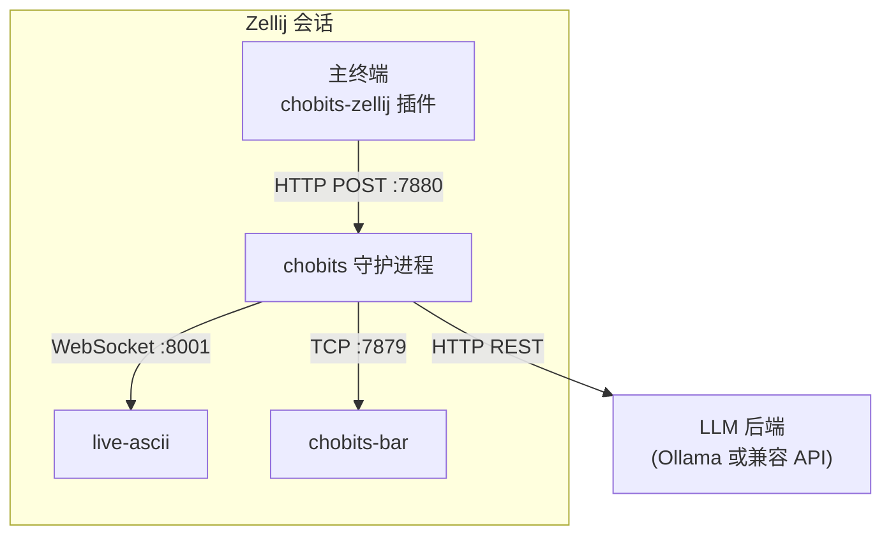

# Chobits

<p align="left">
  <a href="README.md"></a>
  <a href="README.en.md"></a>
</p>

一个住在 Zellij 终端里、由 LLM 驱动的跨平台 Live2D 终端桌宠。


## 支持平台

- Linux
- macOS†
- Windows*

> † 针对 macOS 发布的[预编译二进制文件]((https://github.com/NewComer00/Chobits/releases))未经过 Apple 公证，可能被 Gatekeeper 拦截。您可以选择[从源码构建](#从源码构建)，或按照 [Apple 官方说明](https://support.apple.com/zh-cn/102445)手动放行。

> \* 在 Windows 上编译需要 MSYS2 UCRT64 或 MINGW64。编译生成的二进制文件可直接在原生 Windows 上运行，无需 MSYS2。

## 快速开始

> [!NOTE]  
> 发行的软件包内含从 [Cubism](https://www.live2d.com/en/learn/sample/) 下载的免费模型 ["Hiyori"](https://www.live2d.com/en/learn/sample/momose-hiyori/)。
>
> 使用前请阅读 ["免费素材许可协议"](https://www.live2d.com/eula/live2d-free-material-license-agreement_en.html) 和 ["Live2D Cubism 示例数据使用条款"](https://www.live2d.com/learn/sample/model-terms/)。

您可以通过以下命令安装[最新版本](https://github.com/NewComer00/Chobits/releases/latest)的 Chobits。安装器会自动将 `chobits-start` 命令加入用户 PATH，并在终端打印 `config.toml` 的 `[llm]` 配置示例。

### Linux 安装

需要 Bash 或 Zsh。默认安装位置：`~/.local/share/Chobits`。

```bash
. <(curl -LsSf https://raw.githubusercontent.com/NewComer00/Chobits/main/scripts/install.sh)
```

### macOS 安装

需要 Bash 或 Zsh。默认安装位置：`~/.local/share/Chobits`。

安装完成后请重新打开终端，PATH 修改才会生效。

```bash
curl -LsSf https://raw.githubusercontent.com/NewComer00/Chobits/main/scripts/install.sh | sh
```

Chobits 的相关命令可能被 Gatekeeper 拦截（提示 `operation not permitted`），请按照 [Apple 官方说明](https://support.apple.com/zh-cn/102445)手动放行。

### Windows 安装

需要 PowerShell 5.1 及以上版本。默认安装位置：`%LOCALAPPDATA%\Chobits`。

```powershell
irm https://raw.githubusercontent.com/NewComer00/Chobits/main/scripts/install.ps1 | iex
```

### 配置 LLM 后端

首次运行前，请先编辑 `config.toml`。默认路径为 `~/.local/share/Chobits/config.toml`（Linux / macOS）或 `%LOCALAPPDATA%\Chobits\config.toml`（Windows）。

找到配置文件中的 `[llm]` 部分，Chobits 支持以下 LLM 后端：

**Ollama（本地推理）**

```toml
[llm]
backend    = "ollama"
url        = "http://localhost:11434"
model      = "qwen3:0.6b"
max_tokens = 512
```

**OpenAI 兼容接口**（`backend` 填写除 `ollama` 以外的任意值）

```toml
[llm]
backend    = "deepseek"
url        = "https://api.deepseek.com"
model      = "deepseek-v4-flash"
max_tokens = 512
api_key    = "sk-..."
```

🎉 至此一切就绪，执行 `chobits-start` 命令即可启动 Chobits！🚀

> [!TIP]  
> `chobits-start` 会 创建 或 重新连接 一个专属的 Zellij 会话。其中，守护进程、live-ascii、状态栏和插件都运行在这个独立会话中，与您的日常终端会话互不干扰。
>
> - **首次启动**：第一次启动 `chobits-start` 时，程序将自动创建新的 Zellij 会话。
> - **临时离开**：在 Zellij 中按 `Ctrl+o` 再按 `d`，可暂时离开会话（内部进程切入后台运行，此时 LLM 不再消耗 token）。下次运行 `chobits-start` 时将重新连接会话。
> - **重新连接**：`chobits-start` 会自动重连已有会话（存在多个时会提示选择）。
> - **彻底退出**：按 `Ctrl+q` 彻底关闭当前会话，结束会话中的所有进程。您也可以通过 手动关闭会话里的所有面板 来结束会话。
>
> 更多子命令和会话管理详见[运行](#运行)章节。

手动安装请参考[从发行版下载](#从发行版下载)或[从源码构建](#从源码构建)。完整配置项说明见[配置](#配置)章节。

<details>
<summary>展开：更多安装选项</summary>

### 安装器环境变量

|           变量           |                       默认值                        |             说明              |
| ------------------------ | --------------------------------------------------- | ----------------------------- |
| `CHOBITS_INSTALL_DIR`    | `~/.local/share/Chobits` / `%LOCALAPPDATA%\Chobits` | 安装目录                      |
| `CHOBITS_VERSION`        | `latest`                                            | 指定发行版标签（如 `v0.2.0`） |
| `CHOBITS_LIBC`           | `musl`                                              | 仅 Linux：`musl` 或 `gnu`     |
| `CHOBITS_NO_MODIFY_PATH` | （未设置）                                          | 设为 `1` 跳过 PATH 修改       |

</details>

## 从发行包下载

<details>
<summary>展开</summary>

[Releases](https://github.com/NewComer00/Chobits/releases) 页面提供以下平台的预编译二进制文件：

|                    包名                    |        平台         |                 说明                 |
| ------------------------------------------ | ------------------- | ------------------------------------ |
| `Chobits-x86_64-unknown-linux-gnu.tar.gz`  | x86_64 Linux        | 标准 glibc 动态链接构建              |
| `Chobits-x86_64-unknown-linux-musl.tar.gz` | x86_64 Linux        | 轻量级 musl 静态链接构建，兼容性更广 |
| `Chobits-aarch64-apple-darwin.tar.gz`      | Apple Silicon macOS | 适用于 M 系列 Mac 的 arm64 构建      |
| `Chobits-x86_64-pc-windows-gnu.zip`        | x86_64 Windows      | 原生 Windows 可直接运行，无需 MSYS2  |

下载并解压对应平台的压缩包：

### Linux

推荐使用静态 musl 构建，兼容绝大多数 Linux 发行版：

```bash
wget https://github.com/NewComer00/Chobits/releases/latest/download/Chobits-x86_64-unknown-linux-musl.tar.gz
tar -xzf Chobits-x86_64-unknown-linux-musl.tar.gz
```

如果您使用的是基于 glibc 的系统，也可以选择 `Chobits-x86_64-unknown-linux-gnu.tar.gz`。

### macOS

适用于 M 系列的 arm64 Mac 系统：

```bash
curl -LO https://github.com/NewComer00/Chobits/releases/latest/download/Chobits-aarch64-apple-darwin.tar.gz
tar -xzf Chobits-aarch64-apple-darwin.tar.gz
```

> [!NOTE]  
> 预编译二进制文件未经 Apple 公证。若 macOS 在首次运行时拦截 `chobits-start` 等命令，请按照 [Apple 官方说明](https://support.apple.com/zh-cn/102445)手动放行。

### Windows

```powershell
Invoke-WebRequest -Uri "https://github.com/NewComer00/Chobits/releases/latest/download/Chobits-x86_64-pc-windows-gnu.zip" -OutFile "Chobits-x86_64-pc-windows-gnu.zip"
Expand-Archive -Path "Chobits-x86_64-pc-windows-gnu.zip" -DestinationPath .
```

解压后会得到一个 `Chobits/` 目录，包含所有必要文件。您可以将 `Chobits` 文件夹移到任意位置。

完成后请继续阅读[部署](#部署)章节。

</details>

## 从源码构建

<details>
<summary>展开</summary>

### 前置依赖

|      工具      |                               说明                                |
| -------------- | ----------------------------------------------------------------- |
| git            | 版本控制，用于克隆仓库。                                          |
| git-lfs        | Git 大文件扩展。安装后执行 `git lfs install`。                    |
| cargo          | Rust 工具链，需包含 native 和 `wasm32-wasip1` 目标。              |
| cargo-binstall | 用于快速安装 Zellij。可通过 `cargo install cargo-binstall` 安装。 |
| jq             | JSON 处理工具。                                                   |
| wget           | HTTP 下载工具。                                                   |
| unzip          | ZIP 解压工具。                                                    |
| make           | GNU Make（live-ascii 构建需要）。                                 |
| cc             | C 工具链（live-ascii 构建需要）。                                 |

MSYS2 UCRT64/MINGW64 用户可通过以下命令一键安装：

```bash
pacman -S ${MINGW_PACKAGE_PREFIX}-{git,git-lfs,rust,rust-wasm,jq,wget,gcc} unzip make
cargo install cargo-binstall  # 首次编译可能需要一些时间
```

### 自动构建

```bash
git lfs install
git clone --depth 1 https://github.com/NewComer00/Chobits.git
cd Chobits
# git checkout v0.2.0   # 可选：切换到指定发行版标签
./scripts/build.sh --locked -y
```

### 手动构建

<details>
<summary>展开手动构建步骤</summary>

创建本地目录 `install/Chobits/`，用于存放所有二进制文件、配置、Live2D 模型和表情：

```bash
mkdir -p install/Chobits
```

#### 入口二进制文件

将入口程序 `chobits-start` 安装到 `install/Chobits/bin/`：

```bash
cargo install --path "crates/chobits-start" --root install/Chobits
```

#### 本地二进制文件

将其余二进制文件安装到 `install/Chobits/local/bin/`：

```bash
for c in "" "-bar"; do cargo install --path "crates/chobits$c" --root install/Chobits/local; done
cargo install --path crates/chobits-zellij --root install/Chobits/local --target wasm32-wasip1
```

`chobits`、`chobits-bar` 二进制文件和 WASM 插件（`chobits-zellij.wasm`）将出现在 `install/Chobits/local/bin/`。

接着按照各自说明安装依赖（如 `live-ascii` 和 `zellij`）。建议统一安装到 `install/Chobits/local/bin/` 以保持目录整洁。

从源码安装 `live-ascii`（需要 GNU Make 和 C 工具链）：

```bash
cargo install --git https://github.com/NewComer00/live-ascii --root install/Chobits/local
```

安装 `zellij`（从源码编译或使用 `cargo-binstall` 获取预编译二进制）：

```bash
# 从 Cargo.toml 读取版本号，确保与插件兼容
ZELLIJ_VER=$(cargo metadata --format-version 1 | jq -r '.packages[] | select(.name == "zellij-tile") | .version')

# 从源码编译：
cargo install zellij --version ${ZELLIJ_VER} --root install/Chobits/local

# 或使用 cargo-binstall 获取预编译二进制：
# cargo binstall zellij@${ZELLIJ_VER} --root install/Chobits/local

# MSYS2 UCRT64/MINGW64 用户也可直接从 GitHub Releases 下载预编译二进制：
# wget https://github.com/zellij-org/zellij/releases/download/v${ZELLIJ_VER}/zellij-x86_64-pc-windows-msvc.zip
# unzip zellij-x86_64-pc-windows-msvc.zip -d install/Chobits/local/bin
```

完成后 `install/Chobits/local/bin/` 中应同时包含 `live-ascii` 和 `zellij`。

#### 表情与动作

启动时从 live-ascii VTS 热键**自动发现**动作/表情。在 `config.toml` 的 `[vts.motion_alias]` / `[vts.expression_alias]` 中配置 LLM 可用的友好标签即可，无需 manifest 文件。

```bash
python tool/list_vts_hotkeys.py   # 查看当前模型的 VTS 热键名称
```

#### Live2D 模型

下载您喜欢的 Live2D 模型，将 `.model3.json` 文件放到可访问的位置，记住路径备用。

以免费模型 ["Hiyori"](https://www.live2d.com/en/learn/sample/momose-hiyori/) 为例：

```bash
mkdir -p install/Chobits/models
wget https://cubism.live2d.com/sample-data/bin/hiyori/hiyori_en.zip
unzip hiyori_en.zip
cp hiyori_free install/Chobits/models/ -r
```

#### 配置文件

将示例配置文件复制到 `install/Chobits/config.toml`：

```bash
cp example_config.toml install/Chobits/config.toml
```

</details>

### 格式化、Lint 与测试

```bash
cargo fmt --all --check && cargo clippy-all && cargo test-all && cargo check -p chobits-zellij --target wasm32-wasip1
```

</details>

## 部署

<details>
<summary>展开</summary>

以下是 `Chobits/` 文件夹的最终目录结构（从源码构建时位于 `install/` 下，从发行版解压时位于顶层）。我们称这个文件夹为 **Chobits 根目录**。

您可以将 `Chobits/` 文件夹移到任意位置。MSYS2 UCRT64/MINGW64 用户既可以保留在 MSYS2 环境内，也可以移到原生 Windows 目录。

```
Chobits/
├── .chobits-root
├── bin/
│   └── chobits-start          # Windows 下为 .exe
├── config.toml
├── .zellij/                   # Zellij 配置/数据（[zellij] 路径）
├── .chobits/
│   └── vts_token.json           # VTS 插件认证 token（首次连接后自动创建）
├── local/
│   └── bin/
│       ├── chobits
│       ├── chobits-bar
│       ├── chobits-zellij.wasm
│       ├── live-ascii
│       └── zellij               # Windows 下为 .exe
└── models/
    └── hiyori_free/
        └── runtime/
            └── hiyori_free_t08.model3.json  （含贴图、动作等）
```

</details>

## 配置

所有配置集中在 Chobits 根目录下的 `config.toml` 文件中。[快速安装](#快速开始)的默认配置文件位于 `~/.local/share/Chobits/config.toml`（Linux / macOS）或 `%LOCALAPPDATA%\Chobits\config.toml`（Windows）。

您在配置文件里填写的路径可以是绝对路径，也可以是相对于 **Chobits 根目录**（即 `config.toml` 所在目录）的相对路径，与启动位置无关。

### `[llm]` — 语言模型

驱动桌宠回应的 LLM 后端。可接入任意 Ollama 或 OpenAI 兼容 API。

|      键      |           默认值           |                    说明                    |
| ------------ | -------------------------- | ------------------------------------------ |
| `backend`    | `"ollama"`                 | `"ollama"` 或其他任意值（OpenAI 兼容模式） |
| `url`        | `"http://localhost:11434"` | API 基础 URL                               |
| `model`      | `"qwen3:0.6b"`             | 模型名称                                   |
| `max_tokens` | `512`                      | 每次响应最大 token 数                      |
| `api_key`    | （空）                     | OpenAI 兼容后端的 API 密钥                 |

Ollama 示例：

```toml
[llm]
backend    = "ollama"
url        = "http://localhost:11434"
model      = "qwen3:0.6b"
max_tokens = 512
```

其他 OpenAI 兼容服务示例（`backend != "ollama"`）：

```toml
[llm]
backend    = "deepseek"
url        = "https://api.deepseek.com"
model      = "deepseek-v4-flash"
max_tokens = 512
api_key    = "sk-..."
```

### `[persona]` — 角色设定

定义桌宠角色的个性，将影响角色每一次回答时的风格。

|      键       |   默认值    |               说明                        |
| ------------- | ----------- | ----------------------------------------- |
| `name`        | `"Chi"`     | 在系统提示中使用的角色名                   |
| `description` | （见下方）  | 提供给 LLM 的个性描述                      |

```toml
[persona]
name        = "Chi"
description = """
Curious and warm terminal companion.
You speak in short, casual reactions — one or two sentences max.
You genuinely care about what the user is working on.
"""
```

### `[snapshot]` — 终端轮询

控制 Zellij 插件捕获当前焦点面板快照（文本）的方式和频率。快照会被截断到 `max_bytes`，然后通过 Zellij 的 `web_request` API 以 HTTP POST 发送到 `http://127.0.0.1:{port}/snapshot`（仅本地回环，不对外网暴露）。守护进程在空闲时将变化的快照转发给 LLM。

若焦点面板内容自上次轮询以来未发生变化，守护进程将跳过 LLM 调用以节省 token。

|       键        | 默认值 |               说明               |
| --------------- | ------ | -------------------------------- |
| `port`          | `7880` | 本地 HTTP——插件 `POST /snapshot` |
| `max_bytes`     | `4096` | 快照截断大小（首尾各取一部分）   |
| `interval_secs` | `10`   | 插件面板轮询间隔（秒）           |

```toml
[snapshot]
port          = 7880
max_bytes     = 4096
interval_secs = 10
```

### `[bar]` — 文字反应栏

控制 chobits-bar 滚动面板。鼠标滚轮可翻阅历史；只有当您已在底部时，新消息才会自动滚动。按 `q`、`Esc` 或 `Ctrl+C` 退出反应栏面板。

|        键        | 默认值 |             说明             |
| ---------------- | ------ | ---------------------------- |
| `port`           | `7879` | TCP——守护进程发送文字反应    |
| `history_length` | `50`   | 滚动历史中保留的最大反应条数 |

```toml
[bar]
port           = 7879
history_length = 50
```

<details>
<summary>展开更多配置项</summary>

### `[live-ascii]` — Live2D ASCII 渲染器

用于控制 Live2D ASCII 渲染器，包括模型路径、输入源、协议及视图参数。

当您的焦点位于 Live2D ASCII 窗口内时，可以使用方向键或鼠标拖拽来控制模型位置，也可以通过加减号或鼠标滚轮来控制模型大小。

|        键        |      默认值       |              说明               |
| ---------------- | ----------------- | ------------------------------- |
| `model_set`      | （空）            | `.model3.json` 文件路径         |
| `enable_vts`     | `true`            | `--vts`（VTS API 热键服务器）   |
| `vts_port`       | `8001`            | `--vts-port`                    |
| `enable_mouse`   | `true`            | `--mouse`（拖动平移，滚轮缩放） |
| `enable_physics` | `true`            | `--physics`（发丝/风力物理）    |
| `image_protocol` | `"halfblock"`     | `halfblock`、`kitty` 或 `sixel` |
| `bg_color`       | `"rgba(0,0,0,0)"` | 角色背后的背景色                |
| `scale`          | `"100%"`          | 初始视图缩放比例                |
| `offset_x`       | `"0%"`            | 初始水平偏移（面板宽度百分比）  |
| `offset_y`       | `"0%"`            | 初始垂直偏移（面板高度百分比）  |

内置示例（针对 Hiyori 调整的缩放/偏移）：

```toml
[live-ascii]
model_set      = "models/hiyori_free/runtime/hiyori_free_t08.model3.json"
enable_vts     = true
vts_port       = 8001
enable_mouse   = true
enable_physics = true
image_protocol = "halfblock"
bg_color       = "rgba(0,0,0,0)"
scale          = "550%"
offset_x       = "0%"
offset_y       = "95%"
```

### `[zellij]` — 布局

定义 Zellij 的面板排布方式，包括终端、live-ascii、反应栏、标签栏和状态栏。

KDL 布局使用模板占位符 `{chobits_bin}`、`{plugin_path}`、`{live_ascii_bin}`、`{chobits_bar_bin}`、`{live_ascii_args}`、`{interval_secs}`、`{max_bytes}`、`{snapshot_port}` 等——这些在启动时自动填充，请保留为字面量占位符。

每次启动时，`chobits-start` 会将解析后的布局写入 `.zellij/config/layouts/layout.kdl`，并预授予 WASM 插件权限（`ReadApplicationState`、`ReadPaneContents`、`WebAccess`）。

```toml
[zellij]
config_dir = ".zellij/config"
data_dir   = ".zellij/data"
layout     = """
layout {
    pane size=1 borderless=true {
        plugin location="tab-bar"
    }
    pane split_direction="vertical" {
        pane size=1 borderless=true command="{chobits_bin}" {
            args "--quiet"
        }
        pane focus=true
        pane split_direction="horizontal" size="30%" {
            pane command="{live_ascii_bin}" name="LIVE-ASCII" {
                args {live_ascii_args}
            }
            pane command="{chobits_bar_bin}" size="30%" borderless=true
        }
        pane size=1 borderless=true {
            plugin location="file:{plugin_path}" {
                snapshot_port "{snapshot_port}"
                interval_secs "{interval_secs}"
                max_bytes "{max_bytes}"
            }
        }
    }
    pane size=1 borderless=true {
        plugin location="status-bar"
    }
}
"""
```

```
┌─────────────────────┬──────────┐
│   终端              │live-ascii│
│   (zellij 原生      │          │
│    含插件           ├──────────┤
│    通过面板滚动区   │  回应栏  │
│    轮询快照)        │(ratatui) │
└─────────────────────┴──────────┘
```

### `[idle]` — 待机行为

控制待机独白计时。只有 `[vts.motion_alias]` / `[vts.expression_alias]` 中配置的标签会提供给 LLM。

|         键          |  默认值  |                   说明                    |
| ------------------- | -------- | ----------------------------------------- |
| `idle_timeout_secs` | `30`     | 面板无变化多少秒后进入待机状态            |

```toml
[idle]
idle_timeout_secs = 30
```

旧版配置仍可使用 `[expressions]` 段（字段相同）。

### `[vts]` — VTS 插件客户端

守护进程作为插件客户端连接 live-ascii 内置的 [VTube Studio API](https://github.com/NewComer00/live-ascii) 服务器，触发热键。

|           键           |                默认值                 |                    说明                     |
| ---------------------- | --------------------------------------- | ------------------------------------------- |
| `url`                  | `"ws://127.0.0.1:8001"`                 | VTS WebSocket 地址（端口应与 `vts_port` 一致） |
| `plugin_name`          | `"Chobits"`                             | VTS 中显示的插件名称                        |
| `developer`            | `"Chobits"`                             | 认证用的开发者名称                          |
| `auth_token_path`      | `".chobits/vts_token.json"`             | 保存的认证 token（首次连接后自动创建）      |
| `connect_timeout_secs` | `30`                                    | 等待 live-ascii VTS 就绪的重试超时（秒）    |

将友好标签映射到 VTS 热键名称（`list_vts_hotkeys.py` 输出的 `name` 列）或内部 slug（如 `idle_2`）。数组值表示多个热键，运行时随机选取。

```toml
[vts]
url                  = "ws://127.0.0.1:8001"
plugin_name          = "Chobits"
developer            = "Chobits"
auth_token_path      = ".chobits/vts_token.json"
connect_timeout_secs = 30

[vts.motion_alias]
idle      = "Idle #2"
happy     = "Idle #1"
thinking  = "Flick #0"       # LLM 等待动画；也用于 LLM 响应中的 thinking 标签
worried   = "Flickdown #0"
surprised = "Tap #0"
sad       = "Flick@Body #0"

# 带 .exp3.json 表情的模型可添加 [vts.expression_alias]
# happy = "My Expression Name"
```

</details>

## 运行

### 启动

使用[快速开始](#快速开始)安装器安装后，在任意目录执行：

```bash
chobits-start
```

手动安装或从发行版解压后，在能访问 **Chobits 根目录**的位置执行：

```bash
Chobits/bin/chobits-start
```

配置文件位于 `<Chobits 根目录>/config.toml`。首次运行前请先编辑 `[llm]`。示例参见[快速开始](#快速开始)。

首次启动会自动创建新的 Zellij 会话。后续运行时，`chobits-start` 会自动检测并重连已有会话；若存在多个会话，会提示您选择。

在 Zellij 中按 `Ctrl+o` 再按 `d` 可分离会话而不终止它，再次运行 `chobits-start` 即可重新连接。按 `Ctrl+q` 或关闭所有面板可彻底退出会话。

> [!NOTE]  
> 升级 Chobits 后，请运行一次 `chobits-start`，让 Zellij 加载新的布局变更（如 `snapshot_port`）和刷新后的插件权限。

### 子命令

将参数直接传递给内置的 Zellij 实例：

```bash
chobits-start zellij <args>

# 示例
chobits-start zellij ls                  # 列出所有会话
chobits-start zellij attach --session <name>
chobits-start zellij --help
```

这等价于使用正确的隔离路径执行 `zellij --config-dir ... --data-dir ... <args>`，无需手动指定路径。

> [!NOTE]  
> 分离（`Ctrl+o` 然后 `d`）后，终端快照轮询会暂停，因此没有客户端连接时不会产生 LLM 调用。

## 架构

`chobits-start` 启动 Zellij，其中运行守护进程、live-ascii、chobits-bar 和 `chobits-zellij` WASM 插件。默认本地端口：

|  端口   |          配置键          |   协议    |             用途             |
| ------- | ------------------------ | --------- | ---------------------------- |
| `7880`  | `[snapshot] port`        | HTTP      | 插件 → 守护进程快照          |
| `7879`  | `[bar] port`             | TCP       | 守护进程 → chobits-bar 反应  |
| `8001`  | `[vts] url` / `[live-ascii] vts_port` | WebSocket | 守护进程 → live-ascii VTS API |

**数据流**（客户端连接时）：

```
chobits-start ──▶ zellij 会话（布局来自 config.toml）
                      │
chobits-zellij ──get_pane_scrollback──▶ 快照 JSON
                      │
                      └──HTTP POST :7880──▶ chobits ──┬── TCP:7879 ──▶ chobits-bar
                                              ├── HTTP REST ──▶ LLM 后端
                                              └── WebSocket:8001 ──▶ live-ascii (--vts)
```

客户端分离（detach）时，插件跳过面板轮询。

**布局**（Zellij 内部）：



### 通信接口

|           链路           |                            协议                            |   方向    |
| ------------------------ | ---------------------------------------------------------- | --------- |
| chobits-zellij → chobits | Zellij `web_request` → HTTP POST `127.0.0.1:7880/snapshot` | 单向      |
| chobits → LLM            | HTTP REST（Ollama 或 OpenAI 兼容）                         | 请求/响应 |
| chobits → chobits-bar    | TCP `:7879`（默认），换行符分隔文本                        | 单向      |
| chobits → live-ascii     | WebSocket `:8001`（默认），VTS `HotkeyTriggerRequest`      | 单向      |

## 工具

|                工具                 |                  说明                   |
| ----------------------------------- | --------------------------------------- |
| `tool/list_vts_hotkeys.py`          | 列出 live-ascii VTS 热键，用于填写 `[vts.*_alias]` |

从运行中的 live-ascii 实例查询热键（需要 `pip install websockets`）：

```bash
# 终端 1：带 --vts 启动 live-ascii
# 终端 2：
python tool/list_vts_hotkeys.py
```

将输出的热键 `name` 填入 `config.toml` 的 `[vts.motion_alias]` 或 `[vts.expression_alias]`。

## 相关项目

- [NewComer00/live-ascii](https://github.com/NewComer00/live-ascii)（派生自 [Arcelyth/live-ascii](https://github.com/Arcelyth/live-ascii)，Copyright (c) 2026 Arcelyth，MIT 许可证）

## 许可证

MIT
